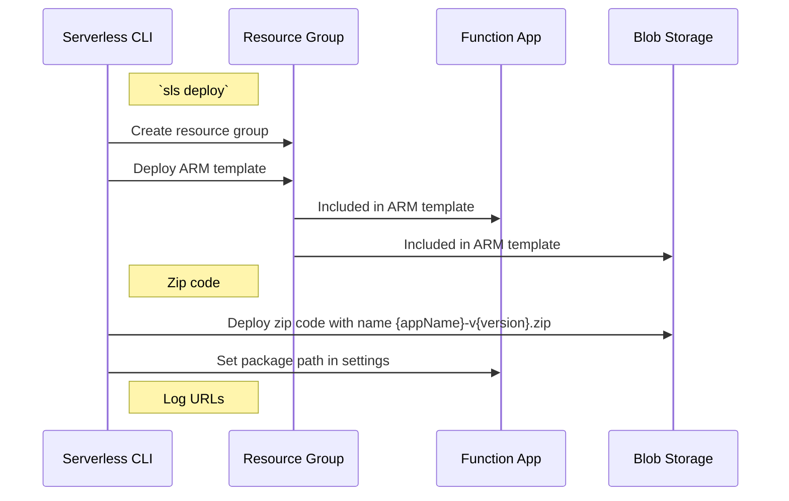

# Deploy Overview

Deploy usage guide and design decision.

## Multi-stage, multi-region deploy

By default, all functions are deploy to a stage (`dev`) and a region.  The
autogenerated resource group name will reflect this information.  The name 
follow the Microsoft recommended [naming convention](https://docs.microsoft.com/en-us/azure/architecture/best-practices/naming-conventions#general).

### Using exitsing resource group

`sls deploy -s dev -r westus2 -g myResourceGroup`

- Use resource group `myResourceGroup`
- Create/Update app service plan, app service
- Zipdeploy code

### No resource group specified

`sls deploy -s dev -r westus2`

- Create if not exist resource group `<service>-dev-westus2-rg`
- Create/Update app service plan, app service
- Zipdeploy code

### Design decision on resource group support

#### Specifying resourceGroup in serverless.yml

- it is not clear if a resourceGroup has already been associated with a given stage and region.  

For example, we have the following default config

```yaml
provider:
  stage: dev
  region: westus
  resourceGroup: myResourceGroup
```

then user try to deploy
`sls deploy -s prod -r westus`

1. Do we use the environment variables / creds associated with `dev` or `prod`?
1. Someone new to the codecase see both the `serverless.yaml` and the command in a CD script, how can they tell which resourceGroup goes where.

#### Specifying resourceGroup in command line

`sls deploy -s prod -r westus -g prodResourceGroup`

1. With this format, it's more clear which stage+region combo is associated with a resourceGroup.  
1. User can still make mistake, however, and use the `wrong` resource group for a specific stage.

#### Don't support user defined resource group

1. always using the right resource group
1. restrictive for user who have already defined their resources

## Deployment Methodologies

#### 1. Deployment to Function App (rollback disabled)
- Deploy resource group, upload packaged artifact directly to function app. Sets function app `RUN_FROM_PACKAGE` setting to `1`.

#### 2. Deployment to Blob Storage (rollback enabled)
- Deploy resource group, upload packaged function app to blob storage with version name. Sets function app `RUN_FROM_PACKAGE` setting to path of zipped artifact in blob storage
- Default container name - `DEPLOYMENT_ARTIFACTS` (configurable in `serverless.yml`, see below)


### Deployment configuration

```yml
service: my-app
provider:
  ...

plugins:
  - serverless-azure-functions

package:
  ...

deploy:
  # Rollback enabled, deploying to blob storage
  # Default is true
  # If false, deploys directly to function app
  rollback: true
  # Container in blob storage containing deployed packages
  # Default is DEPLOYMENT_ARTIFACTS
  container: MY_CONTAINER_NAME

functions:
  ...
```

If rollback is enabled, the name of the created package will include the timestamp of its creation. This timestamp will also be included in the name of the Azure deployment so as to be able to link the two together. Both names will be with `{serviceName}-t{timestamp}` (with `.zip` in the case of the packaged code).

##### Sequence diagram for deployment to blob storage



##### Sub-Commands

- `sls deploy list` - Logs list of deployments to configured resource group with relevant metadata (name, timestamp, etc.). Also logs versions of deployed function app code if available

