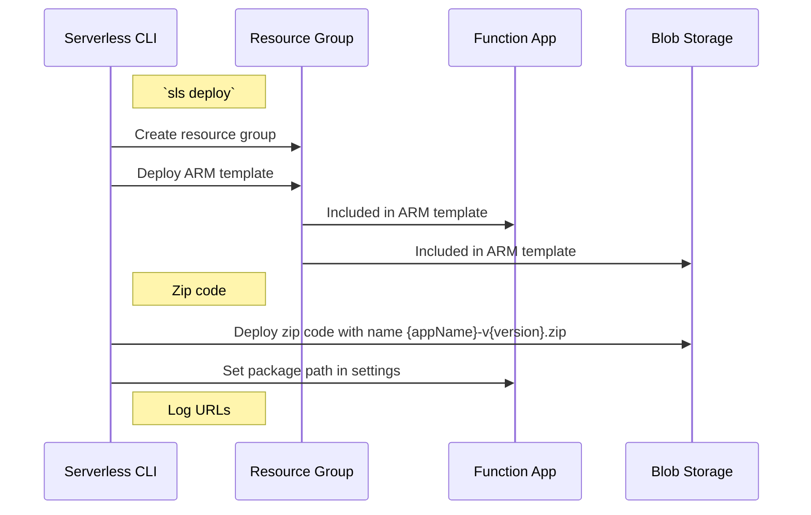

# Deploy

##### `sls deploy`
- Description: Deploy resource group containing function app and other resources. Also deploys Function App code
- Two Approaches:
  - Deploy resource group, upload packaged artifact directly to function app. Sets function app `RUN_FROM_PACKAGE` setting to `1`.
  - Deploy resource group, upload packaged function app to blob storage with version name. Sets function app `RUN_FROM_PACKAGE` setting to path of zipped artifact in blob storage
- Open Questions:
  - Default to deploy to blob storage? Default to zip deploy directly to function app?
  - Container name for code artifacts? Hard coded? Configurable? Default to ARTIFACTS?
  - Version name conflicts simply overwrite previous artifact?

##### Sequence diagram for deployment to blob storage

##### Sub-Commands

- `sls deploy list` - Logs list of deployments to configured resource group with relevant metadata (name, timestamp, etc.). Also logs versions of deployed function app code if available

