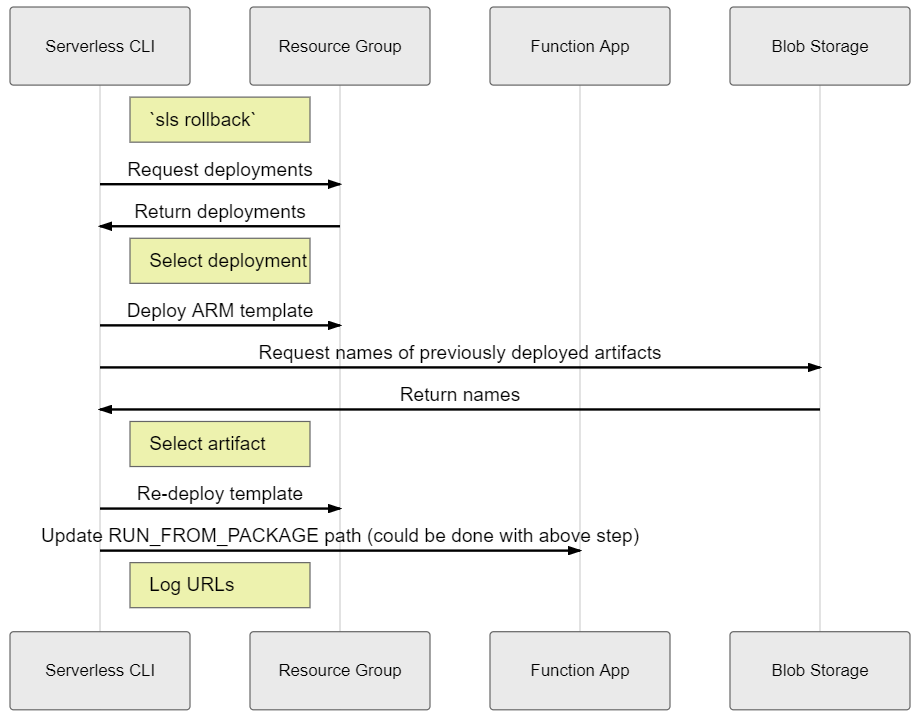

# Rollback

##### `sls rollback`
- Description - Roll back deployment of Function App & Resource Group
- Options:
  - `-t` or `--timestamp` - Timestamp associated with version to target
  - Use `sls deploy list` to discover timestamps
  - Defaults to previous deployment
- **Important to note that there is no option for rolling back an individual function. A function app is considered one unit and will be rolled back as such.**
- In order to roll back your function app, make sure your `deploy.rollback` is either set to `true` or not specified (defaults to `true`). The container in Azure Blob Storage which contains the packaged code artifacts can also be specified, defaults to `DEPLOYMENT_ARTIFACTS` (see [deploy documentation](./DEPLOY.md))

##### Example usage

```bash
# List all deployments to know the timestamp for rollback
$ sls deploy list
Serverless:
-----------
Name: myFunctionApp-t1561479533 
Timestamp: 1561479533
Datetime: 2019-06-25T16:18:53+00:00
-----------
Name: myFunctionApp-t1561479506
Timestamp: 1561479506
Datetime: 2019-06-25T16:18:26+00:00
-----------
Name: myFunctionApp-t1561479444
Timestamp: 1561479444
Datetime: 2019-06-25T16:17:24+00:00
-----------

$ sls rollback -t 1561479506
```

##### Sequence diagram for rollback

