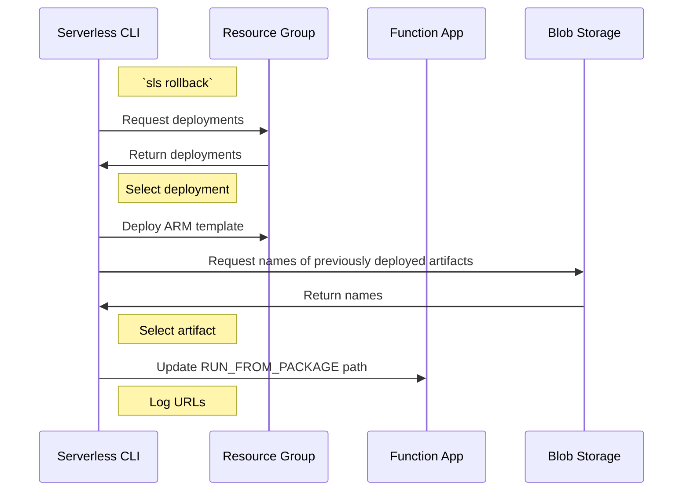

# Rollback

##### `sls rollback`
- Description - Roll back deployment of Function App & Resource Group
- Options:
  - `-t` or `--timestamp` - Timestamp associated with version to target
  - `-v` or `--version` - Version of function app
  - Use `sls deploy list` to discover timestamps and versions
  - Defaults to previous deployment and version number
- Important to note that there is no option for rolling back an individual function. A function app is considered one unit and will be rolled back as such.
- Open questions:
  - How to ensure rollback to corresponding ARM deployment and function app from blob storage? Custom named deployments containing version number?

##### Sequence diagram for rollback

