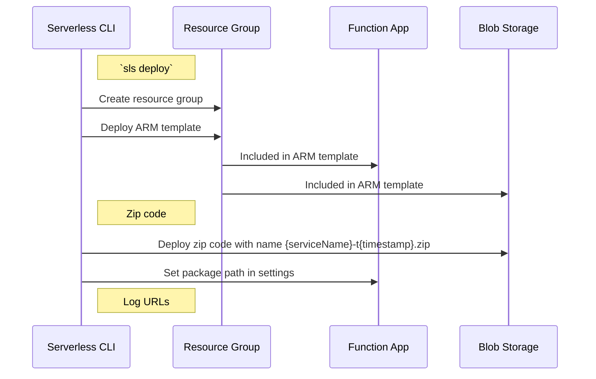

```mermaid
sequenceDiagram
  participant s as Serverless CLI
  participant r as Resource Group 
  participant f as Function App
  participant b as Blob Storage

  note right of s: `sls deploy`
  s ->> r: Create resource group
  s ->> r: Deploy ARM template
  r ->> f: Included in ARM template
  r ->> b: Included in ARM template
  note right of s: Zip code
  s ->> b: Deploy zip code with name {serviceName}-t{timestamp}.zip
  s ->> f: Set package path in settings
  note right of s: Log URLs 
```