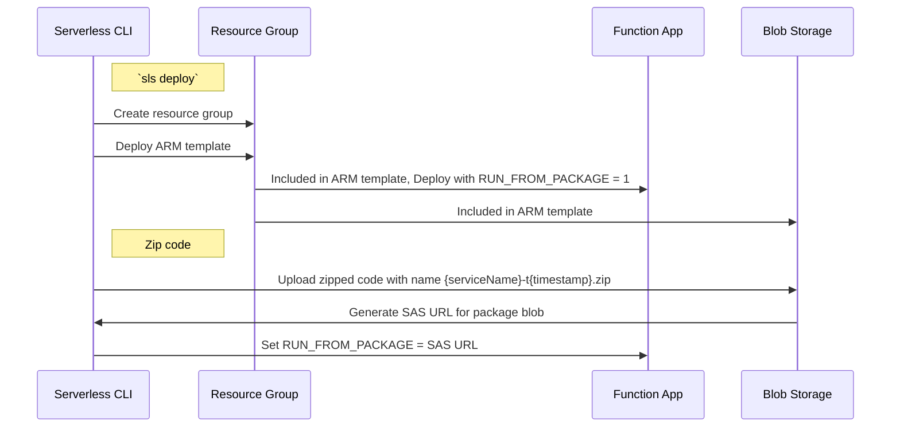

## Deployment - External Package

```mermaid
sequenceDiagram
  participant s as Serverless CLI
  participant r as Resource Group
  participant f as Function App
  participant b as Blob Storage

  note right of s: `sls deploy`
  s ->> r: Create resource group
  s ->> r: Deploy ARM template
  r ->> f: Included in ARM template, Deploy with RUN_FROM_PACKAGE = 1
  r ->> b: Included in ARM template
  note right of s: Zip code
  s ->> b: Upload zipped code with name {serviceName}-t{timestamp}.zip
  b ->> s: Generate SAS URL for package blob
  s ->> f: Set RUN_FROM_PACKAGE = SAS URL
```
