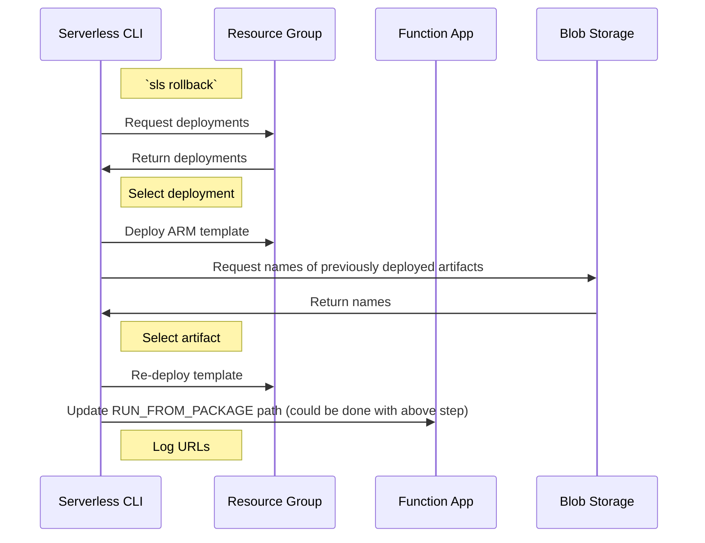

```mermaid
sequenceDiagram
  participant s as Serverless CLI
  participant r as Resource Group 
  participant f as Function App
  participant b as Blob Storage

  note right of s: `sls rollback`
  s ->> r: Request deployments
  r ->> s: Return deployments
  note right of s: Select deployment
  s ->> r: Deploy ARM template
  s ->> b: Request names of previously deployed artifacts
  b ->> s: Return names
  note right of s: Select artifact
  s ->> r: Re-deploy template
  s ->> f: Update RUN_FROM_PACKAGE path (could be done with above step)
  note right of s: Log URLs
```